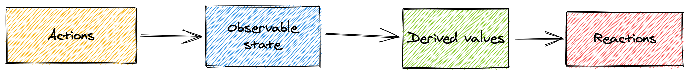

# Concepts

1. State - the data that drives (manages) your application.
2. Actions - any piece of code that changes the state.
3. Derivations (производные) - anything that can be derived from the state without any further interaction

# Algorithm

## 1. Define state and make it observable

Store state in any data structure you like: plain objects, arrays, classes, cyclic data structures or references.

``` js
import { makeObservable, observable, action } from "mobx"

class Todo {
    id = Math.random()
    title = ""
    finished = false

    constructor(title) {
        makeObservable(this, {
            title: observable,
            finished: observable,
            toggle: action
        })
        this.title = title
    }

    toggle() {
        this.finished = !this.finished
    }
}
```

## 2. Update state using actions

It is recommended that you mark any piece of code that changes observable's as an action.

Methods that modify state are called actions. Views are methods which compute new information based on the current state. Every method should serve only one of those two goals.

## 3. Create derivations that automatically respond to state changes

MobX distinguishes (differs) between two kinds of derivations:

1. *Computed values*, which can always be derived (получены) from the current observable state using a pure function
2. *Reactions*, side effects that need to happen automatically when the state changes

The golden rule is, always use *computed* if you want to create a value based on the current state.

### 3.1. Model derived values using computed

```js
import { makeObservable, observable, computed } from "mobx"

class TodoList {
    todos = []
    get unfinishedTodoCount() {     // creation computed value
        return this.todos.filter(todo => !todo.finished).length
    }
    constructor(todos) {
        makeObservable(this, {
            todos: observable,
            unfinishedTodoCount: computed
        })
        this.todos = todos
    }
}
```

### 3.2. Model side effects using reactions

Reactions produce side effects like: printing to the console, making network requests, incrementally updating React component tree to patch the DOM, etc.

```jsx
import * as React from "react"
import { render } from "react-dom"
import { observer } from "mobx-react-lite"

const TodoListView = observer(({ todoList }) => (
    <div>
        <ul>
            {todoList.todos.map(todo => (
                <TodoView todo={todo} key={todo.id} />
            ))}
        </ul>
        Tasks left: {todoList.unfinishedTodoCount}
    </div>
))

const TodoView = observer(({ todo }) => (
    <li>
        <input type="checkbox" checked={todo.finished} onClick={() => todo.toggle()} />
        {todo.title}
    </li>
))

const store = new TodoList([new Todo("Get Coffee"), new Todo("Write simpler code")])
render(<TodoListView todoList={store} />, document.getElementById("root"))
```

# Principles

MobX uses a uni-directional (однонаправленный) data flow where actions change the state, which in turn updates all affected views.



1. All derivations are updated automatically and atomically when the state changes.
2. All derivations are updated synchronously by default (actions can safely inspect a computed value directly after altering the state).
3. Computed values are updated lazily. Any computed value that is not actively in use will not be updated until it is needed for a side effect (I/O).
4. All computed values should be pure. They are not supposed to change state.
